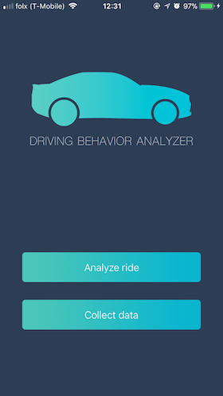
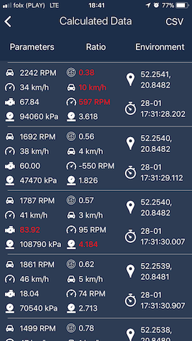
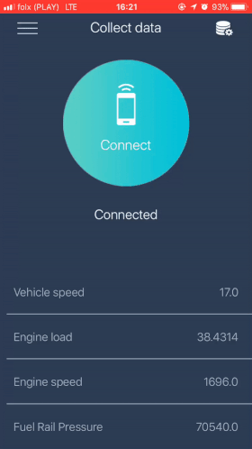

[WIP] An application created as part of the master's thesis analyzing user driving style, using data from the OBD II interface and Machine Learing Core. 
Driving Behaviour Analyzer consists of two parts:

### Collecting data

Part of the application that collects and analyzes data from ODB II interface while driving a car.
The analyzed data are generated into the CSV file and used to trained the machine learning model in XGBoost library.

### Driving Behaviour Analyzer

Part of the application for the user whose driving style will be analyzed. Data from OBD II interface 
on the test route are processed and saved in Realm database. Using the trained model and ML Core application
determines what type of drive is user.

## Build and Runtime Requirements
+ Xcode 9.0 or later
+ iOS 9.0 or later
+ macOS v10.10 or later

## Installation

### Setup Cocoapods repository

1. Run `pod install` to correctly setup the Cocoapods dependencies
2. Make sure that you open the project referring to  `*.xcworkspace` in Xcode or AppCode

## Screenshots

## Built With

* [XGBoost](https://xgboost.readthedocs.io/en/latest/)
* [Core ML](https://developer.apple.com/machine-learning/)
* [OBD2-Swift](https://github.com/lemberg/obd2-swift-lib)
* [SwifterSwift](https://github.com/SwifterSwift/SwifterSwift)
* [Kingfisher](https://github.com/onevcat/Kingfisher)
* [SwiftSpinner](https://github.com/icanzilb/SwiftSpinner)
* [RealmSwift](https://realm.io/docs/swift/latest/)
* [ObjectMapper+Realm](https://github.com/Jakenberg/ObjectMapper-Realm)
* [Moya](https://github.com/Moya/Moya)

